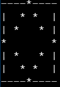
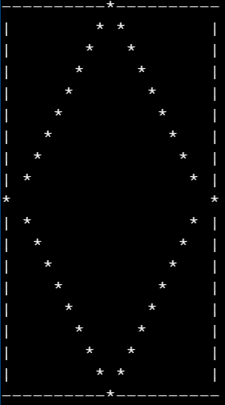

# interview-qns-solved
A collection of solutions to the coding interview questions I've solved so far.

## Questions

1. Based on the input given, pattern should meet the following requirements: 
    * Total number of roes and columns should match the input
    * First and last columns should have characters formed by hyphens "-", except middle column
    * First and last rows should have characters formed by vertical bar "|", except middle row
    * Diamond pattern, formed by character star "*", should start from middle column of first row and end at middle column of last row, connecting middle row of first column and middle row of last column.
    
    * For *example*:
        - input n=9, 
    output should be,
        
            
        - input n=21,
    output should be,  
            

   >Solution : [Diamond Pattern](diamond-pattern.py) 
2. Print an integer representing the minimum number of bits required to be flipped to convert message P to message Q.
    * *Example* 
         Input:  
         7 10 
         Output: 
         3
    * Explanation: 
     Binary representation of P is 00000111 
     Binary representation of P is 00001010 
     We need to flip three bits of P at position 5,6.
   >Solution : [Flipping Bits](flipping-bits.py)
         
